# Minecraft Asset Renderer

Headless rendering library for Minecraft blocks, items, entities, fluids, and portals. Reads a vanilla client JAR and any stack of resource packs, then produces isometric or 2D previews as static PNGs or animated frame sequences.

> [!IMPORTANT]
> This library downloads and processes **copyrighted assets owned by [Mojang AB](https://www.minecraft.net/)** (a Microsoft subsidiary) at runtime. Models, textures, and the rest of the client's `assets/` and `data/` trees are extracted directly from the official Minecraft client JAR and are **never distributed** with this repository. You are responsible for ensuring your use of the rendered output complies with the [Minecraft EULA](https://www.minecraft.net/en-us/eula) and [Minecraft Usage Guidelines](https://www.minecraft.net/en-us/usage-guidelines).

## Table of Contents

- [Features](#features)
- [Getting Started](#getting-started)
  - [Prerequisites](#prerequisites)
  - [Installation](#installation)
  - [Usage](#usage)
- [Renderers](#renderers)
  - [BlockRenderer](#blockrenderer)
  - [ItemRenderer](#itemrenderer)
  - [EntityRenderer](#entityrenderer)
  - [PlayerRenderer](#playerrenderer)
  - [FluidRenderer](#fluidrenderer)
  - [PortalRenderer](#portalrenderer)
  - [TextRenderer](#textrenderer)
  - [AtlasRenderer](#atlasrenderer)
  - [GridRenderer](#gridrenderer)
  - [LayoutRenderer](#layoutrenderer)
  - [MenuRenderer](#menurenderer)
- [Gradle Tasks](#gradle-tasks)
  - [Build and Test](#build-and-test)
  - [Visual Inspection](#visual-inspection)
  - [JMH Benchmarks](#jmh-benchmarks)
- [Package Structure](#package-structure)
- [Resource Tooling](#resource-tooling)
  - [Runtime Directories](#runtime-directories)
- [Contributing](#contributing)
- [License](#license)

## Features

- **Pluggable renderers** - `BlockRenderer`, `ItemRenderer`, `EntityRenderer`, `PlayerRenderer`, `FluidRenderer`, `PortalRenderer`, `TextRenderer`, plus composite `AtlasRenderer`, `GridRenderer`, `LayoutRenderer`, and `MenuRenderer`
- **Minecraft 26.1 and later** - Pulls client JARs via the Piston API and loads overlay resource packs (CIT, CTM, banner patterns, custom item definitions) on top of vanilla (the asset / pack-format parsing targets the 26.1+ client-jar layout)
- **Isometric or 2D output** - one `ModelEngine`, driven by a `Projection` pairing a camera pose with a `Lens` (orthographic, perspective or oblique); `VANILLA_ISO` reproduces vanilla's `[30, 225, 0]` `display.gui` pose, and the block, item, fluid and portal renderers each offer a flat 2D type beside it
- **Static PNG or animated frames** - Returns `StaticImageData` or `AnimatedImageData` from [simplified-dev/image](https://github.com/simplified-dev/image) - animated textures, portals, and fluids drive multi-frame output transparently
- **Vector API SIMD** - JDK 21 incubator `FloatVector` backs `Vector3f.transform` / `transformNormal` and `Matrix4f.multiply`, the three methods under every vertex `ModelEngine` projects; a JVM without the module resolves the scalar fallback instead, bit-for-bit
- **Stateless renderers** - All input flows through an immutable options object built by its own `builder()`; renderers share an ambient `RendererContext` and can be cached for the lifetime of a pack stack

## Getting Started

### Prerequisites

| Requirement | Version | Notes |
|-------------|---------|-------|
| [JDK](https://adoptium.net/) | **21** | Exactly 21 - the toolchain the renderer, `:tooling` and `parity` all request. Compiling this repository needs the Vector API (`jdk.incubator.vector`) on the module path; the build wires the flag into every task |
| [JDK](https://adoptium.net/) | **25** | The harness toolchain. `./gradlew build` reaches `check`, and `check` compiles the harness through its own wrapper - nothing auto-provisions a toolchain, so both JDKs must already be installed |
| [Gradle](https://gradle.org/) | 9.4.1 | Wrapper is bundled (`./gradlew`), for this build and the harness alike |
| [Python](https://www.python.org/) | 3.11+ | `check` runs the parity toolkit's own suite and the reach check; the interpreter is found on `PATH`, or named with `-PpythonExe` / `PARITY_PYTHON` |
| [Git](https://git-scm.com/) | 2.x+ | For cloning the repository |

> [!IMPORTANT]
> The `--add-modules=jdk.incubator.vector` flag is required to **build this repository** - the `tensor` sources reference the incubator package directly - and the Gradle build wires it into every compile, test, `JavaExec`, JMH fork and `javadoc` task automatically. **Downstream consumers of the published JAR do not need it.** `SimdSupport` probes for the module once via `Class.forName` and dispatches to a bit-identical scalar implementation when it is absent, so a stock JDK 21 runs the library without the flag and without a class-not-found failure. Add it only to put your own JVM back on the SIMD path.

### Installation

Add the JitPack repository and the dependency to your `build.gradle.kts`:

```kotlin
repositories {
    maven(url = "https://jitpack.io")
}

dependencies {
    implementation("com.github.minecraft-library:asset-renderer:master-SNAPSHOT")
}
```

That is the whole of it - no module flags. To put your own JVM back on the SIMD path rather than the scalar fallback, add the incubator module wherever you launch one:

```kotlin
tasks.withType<JavaExec>().configureEach {
    jvmArgs("--add-modules=jdk.incubator.vector")
}
```

Or clone and build locally:

```bash
git clone https://github.com/minecraft-library/asset-renderer.git
cd asset-renderer
./gradlew test
```

`./gradlew build` also compiles the reference harness, which is a Fabric mod: the first run resolves Fabric Loom, Minecraft 26.1.2 and the Fabric API from the network. `./gradlew test` is the gate that stays inside this build.

### Usage

Acquire the client assets once, wrap them in a `PipelineRendererContext`, then instantiate any `Renderer<O>` against that context:

```java
// 1. Configure the client. The version, the cache root, and any resource packs to stack on top of
//    vanilla in ascending priority order.
ClientOptions clientOptions = ClientOptions.builder()
    .version("26.1")
    .texturePacks(Concurrent.newList(myResourcePackZip))
    .build();

// 2. Acquire the assets. ClientAcquisition.acquire is static; it downloads the client JAR on first
//    call and caches it under ClientOptions.cacheRoot for subsequent runs. All Mojang network
//    access flows through a shared MojangContract proxy on ClientAcquisition.mojang() (see
//    api.simplified.mojang for the upstream contract).
ClientAssets assets = ClientAcquisition.acquire(clientOptions);

// 3. Wrap the assets in a context. Eagerly materialises every block/item entity; textures stream
//    from disk on first lookup and are then cached. Renderers are stateless - build them over this
//    context once and cache them for its lifetime.
PipelineRendererContext context = PipelineRendererContext.of(assets);
```

Every renderer below takes that `context` and nothing else. Output size, projection, and SSAA / FXAA live on the shared `OutputOptions`.

> [!NOTE]
> `ImageData` is either `StaticImageData` (single frame) or `AnimatedImageData` (multiple frames with per-frame delay). Items (enchant glint / animated sprites), fluids, and portals return the animated variant; each renderer below says what makes it animate. Branch on `image.isAnimated()` or call `image.getFrames()` to iterate - and note that `image.toBufferedImage()` answers frame zero, so an animated render written through it silently keeps only the first frame.

> [!IMPORTANT]
> `ClientOptions` supports Minecraft **`26.1` (the default) and later only** - the asset extraction and pack-format parsing target the 26.1+ client-jar layout, so earlier versions are not supported. The JAR is cached under `cacheRoot` (default `./cache/asset-renderer`); pass `forceDownload(true)` on the builder to re-fetch after a version bump.

## Renderers

Every image below was rendered by this library, and each snippet is the code that produced the one above it. They are regenerated rather than captured: `ReadmeShowcaseTest` owns one case per renderer, and `./gradlew :test --tests "*ReadmeShowcaseTest" -Dasset.showcase.regenerate=true --rerun` rewrites the lot.

### BlockRenderer

Draws a block at vanilla's authored `display.gui` pose, resolving its blockstate, its model tree and any block-entity mesh, then tinting only the faces that carry a `tintindex`. Grass is the whole contract in one image: the top face takes the biome colormap and the dirt sides do not.

<div align="center">
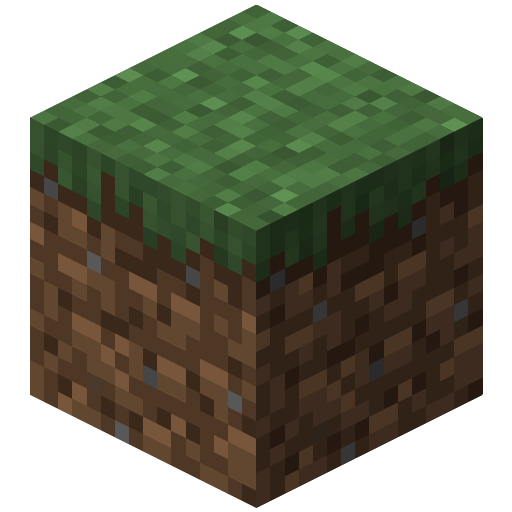
</div>

```java
BlockOptions options = BlockOptions.builder()
    .blockId("minecraft:grass_block")
    .type(BlockOptions.Type.ISOMETRIC_3D)          // or BLOCK_FACE_2D for one flat face
    .biome(Biome.INVENTORY_DEFAULT)                // the tint point vanilla uses with no world context
    .output(OutputOptions.builder().canvasSize(512).supersample(2).antiAlias(true).build())
    .build();

ImageData block = new BlockRenderer(context).render(options);
new ImageFactory().toFile(block, ImageFormat.PNG, new File("grass_block.png"));
```

### ItemRenderer

Composes an item's `layer0..layerN` sprites with their tints, then applies the enchantment glint as a whole-strip finish rather than a layer. A glinted item is the one subject that turns a single option into a moving image: the foil scroll multiplies one baked frame into a two-second loop.

<div align="center">
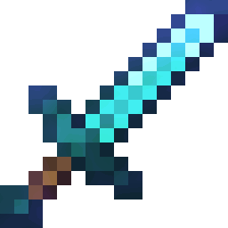
</div>

```java
ItemOptions options = ItemOptions.builder()
    .itemId("minecraft:diamond_sword")
    .type(ItemOptions.Type.GUI_2D)                 // or HELD_3D, or GUI_ICON for a block-backed id
    .enchanted(true)                               // the glint finish -> AnimatedImageData
    .output(ItemOptions.DEFAULT_OUTPUT.mutate().canvasSize(256).build())
    .build();

ImageData glinted = new ItemRenderer(context).render(options);
new ImageFactory().toFile(glinted, ImageFormat.GIF, new File("diamond_sword.gif"),
    GifWriteOptions.builder().withLoopCount(0).isTransparent(true).withAlphaThreshold(8).build());
```

### EntityRenderer

Renders any of the entities whose bone trees were walked out of vanilla's own model classes, posed by a named style. `AppearanceOptions` selects the per-entity axes - age, behavioural state, dye tints, tropical-fish pattern, equipment - and the `style` axis is what makes the render move: `stride` plays one whole walk cycle.

<div align="center">
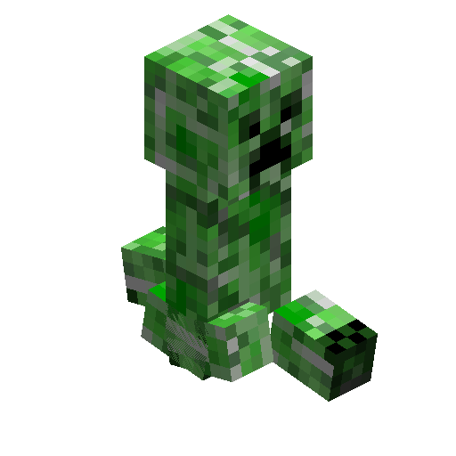
</div>

```java
EntityRenderer renderer = new EntityRenderer(context, EntityModelLoader.load());

EntityOptions options = EntityOptions.builder()
    .entityId("minecraft:creeper")
    .style(PoseStyle.STRIDE)                       // bind (still, the default), idle, stride, animated
    .fitMode(EntityOptions.FitMode.OUTPUT_SIZE)
    .padding(16)
    .output(OutputOptions.builder().canvasSize(512).supersample(4).build())
    .build();

ImageData walking = renderer.render(options);      // one stride -> AnimatedImageData
```

### PlayerRenderer

Builds a player from a skin - by texture id, raw PNG bytes, or a Mojang texture URL - and layers worn equipment over it, base armour sheet plus trim palette. `Type` picks the scope (`SKULL`, `BUST`, `FULL`) and `Dimension` picks a flat sprite composite or an isometric rasterisation; the cape and elytra need the 3D bust or full scope.

<div align="center">
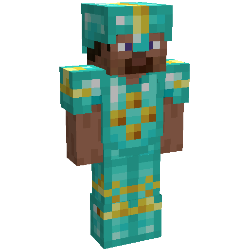
</div>

```java
ArmorPiece diamond = ArmorPiece.of(ArmorMaterial.DIAMOND, ArmorTrim.Color.GOLD, ArmorTrim.Pattern.SENTRY);

PlayerOptions options = PlayerOptions.builder()
    .type(PlayerOptions.Type.FULL)                 // or SKULL, or BUST
    .dimension(PlayerOptions.Dimension.THREE_D)    // or TWO_D for the flat sprite composite
    .skin(SkinOptions.builder()
        .skin(TextureOptions.builder().id("minecraft:entity/player/wide/steve").build())
        .build())
    .armor(ArmorOptions.builder()
        .helmet(diamond).chestplate(diamond).leggings(diamond).boots(diamond)
        .build())
    .output(OutputOptions.builder()
        .projection(Projection.PORTRAIT)           // VANILLA_ISO is the default, and frames a bust better
        .canvasSize(512)
        .supersample(4)
        .build())
    .build();

ImageData player = new PlayerRenderer(context).render(options);
```

### FluidRenderer

Renders water or lava as a cube with four independent corner heights, a flow-direction UV rotation, and the biome tint the fluid takes in-world. Naming a frame count plays the shipped `water_still` / `lava_still` flipbook rather than pinning it to one frame.

<div align="center">
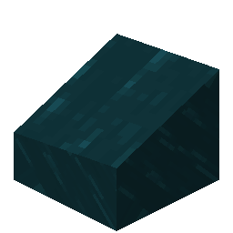
</div>

```java
FluidOptions options = FluidOptions.builder()
    .fluid(FluidOptions.Fluid.WATER)               // or LAVA, which is untinted by construction
    .biome(Biome.Vanilla.WARM_OCEAN)
    .cornerHeights(new FluidOptions.CornerHeights(0.875f, 0.5f, 0.375f, 0.75f))
    .flowAngleRadians((float) Math.toRadians(45))
    .output(OutputOptions.builder().canvasSize(256).supersample(2).build())
    .animation(AnimationOptions.builder().frameCount(32).ticksPerFrame(2).build())
    .build();

ImageData water = new FluidRenderer(context).render(options);   // 32 frames -> AnimatedImageData
```

### PortalRenderer

CPU-bakes vanilla's `rendertype_end_portal` shader - sixteen parallax star-field layers, each on its own drifting transform - onto real geometry rather than approximating it with a texture. The end gateway is the full unit cube, so the field lands on three visible faces at once.

<div align="center">
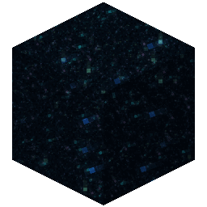
</div>

```java
PortalOptions options = PortalOptions.builder()
    .portal(PortalOptions.Portal.END_GATEWAY)      // or END_PORTAL, the thin slab
    .type(PortalOptions.Type.ISOMETRIC_3D)
    .output(OutputOptions.builder().canvasSize(256).supersample(2).build())
    .animation(AnimationOptions.builder().frameCount(40).ticksPerFrame(1).build())
    .build();

ImageData gateway = new PortalRenderer(context).render(options);
```

### TextRenderer

Lays out legacy `&`-coded text under vanilla's real nine-sliced tooltip chrome, measuring the canvas from the glyphs rather than taking a size. It is the one renderer whose animation is a property of the content: an obfuscated (`&k`) run or a scrolling gradient is what promotes the output to a strip.

<div align="center">
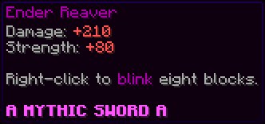
</div>

```java
TextOptions options = TextOptions.builder()
    .style(TextOptions.Style.LORE)                 // or CHAT
    .lines(LineSegment.fromLegacy(String.join("\n",
        "&5Ender Reaver",
        "&7Damage: &c+210",
        "",
        "&d&l&ka &r&d&lMYTHIC SWORD &d&l&ka"), '&'))
    .chrome(TooltipChrome.Vanilla.SPRITE)          // the pack's own sprites, nine-sliced
    .chromeSprites(TooltipChrome.ChromeSprites.resolve(context, null).orElseThrow())
    .build();

ImageData tooltip = new TextRenderer().render(options);         // the &k footer -> AnimatedImageData
```

### AtlasRenderer

Renders every block and item the pack stack resolves into one tile sheet, dropping a subject that fails rather than failing the run. `renderAtlas` hands back the same image beside an `AtlasSidecar` of per-tile coordinates and ids, so the sheet is addressable rather than just a picture.

<div align="center">
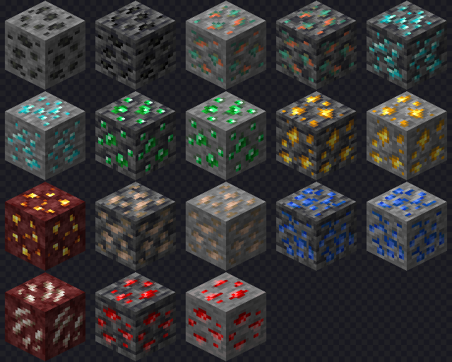
</div>

```java
AtlasOptions options = AtlasOptions.builder()
    .filter(id -> id.endsWith("_ore"))             // omit for every block and item in the game
    .tileSize(128)
    .columns(5)
    .background(Background.checkerboard())
    .progressLogging(false)                        // on by default; a library consumer wants it off
    .build();

AtlasRenderer.AtlasResult sheet = new AtlasRenderer(context).renderAtlas(options);
new ImageFactory().toFile(sheet.image(), ImageFormat.PNG, new File("ores.png"));
```

### GridRenderer

Composes images other renderers already produced into a grid, at explicit cell coordinates rather than in list order - so a sparse sheet is legal. It takes no `RendererContext`: the canvas is derived from the cell size, the column and row counts, and the separation, which is the gutter and the outer margin both.

<div align="center">
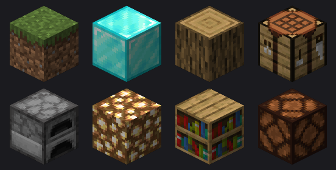
</div>

```java
BlockRenderer blocks = new BlockRenderer(context);
String[] ids = {
    "minecraft:grass_block", "minecraft:diamond_block", "minecraft:oak_log", "minecraft:crafting_table",
    "minecraft:furnace", "minecraft:glowstone", "minecraft:bookshelf", "minecraft:redstone_lamp"
};

ConcurrentList<GridOptions.GridTile> tiles = Concurrent.newList();
for (int i = 0; i < ids.length; i++)
    tiles.add(new GridOptions.GridTile(i % 4, i / 4, blocks.render(BlockOptions.builder()
        .blockId(ids[i])
        .output(OutputOptions.builder().canvasSize(128).supersample(2).antiAlias(true).build())
        .build())));

ImageData sheet = new GridRenderer().render(GridOptions.builder()
    .tiles(tiles)
    .cellSize(128)
    .columns(4)
    .rows(2)
    .separation(8)                                 // the gap between cells and the margin around them
    .background(Background.solid(0xFF1B1B1F))
    .build());
```

### LayoutRenderer

Arranges heterogeneous children on one canvas - a row, a column, a grid, a stack, or explicit coordinates - measuring each child before placing any, so an anchor can align against a neighbour whose size is not known up front. Children are suppliers invoked once per render, so building the options renders nothing.

<div align="center">
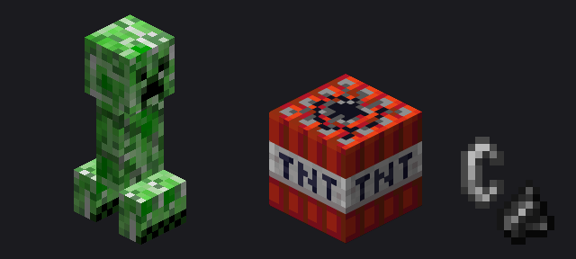
</div>

```java
LayoutOptions options = LayoutOptions.builder()
    .layout(new LayoutOptions.Layout.Row(16, LayoutOptions.Layout.Alignment.END))
    .child(new EntityRenderer(context, EntityModelLoader.load()), EntityOptions.builder()
        .entityId("minecraft:creeper")
        .output(OutputOptions.builder().canvasSize(256).supersample(2).build())
        .build())
    .child(new BlockRenderer(context), BlockOptions.builder()
        .blockId("minecraft:tnt")
        .output(OutputOptions.builder().canvasSize(192).supersample(2).antiAlias(true).build())
        .build())
    .child(new ItemRenderer(context), ItemOptions.builder()
        .itemId("minecraft:flint_and_steel")
        .type(ItemOptions.Type.GUI_ICON)
        .output(ItemOptions.DEFAULT_OUTPUT.mutate().canvasSize(128).build())
        .build())
    .background(Background.solid(0xFF1B1B1F))
    .build();

ImageData scene = new LayoutRenderer().render(options);   // each child is resolved exactly once
```

### MenuRenderer

Draws a vanilla container screen at exact GUI geometry - the chest, shulker box, hopper, dispenser, crafting table, anvil and player screens - and places caller content on the cells that layout produced. A slot takes an item id, a full `ItemOptions`, or a render the caller has already sized.

<div align="center">
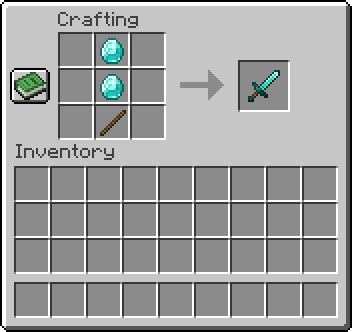
</div>

```java
ConcurrentMap<Integer, MenuOptions.MenuSlotContent> slots = Concurrent.newMap();
slots.put(1, MenuOptions.MenuSlotContent.of("minecraft:diamond"));
slots.put(4, MenuOptions.MenuSlotContent.of("minecraft:diamond"));
slots.put(7, MenuOptions.MenuSlotContent.of("minecraft:stick"));
slots.put(9, MenuOptions.MenuSlotContent.of("minecraft:diamond_sword"));   // the result cell

ImageData menu = new MenuRenderer(context).render(MenuOptions.builder()
    .type(MenuOptions.Type.CRAFTING_TABLE)
    .title("Crafting")
    .playerInventory(true)
    .slots(slots)
    .build());
```

## Gradle Tasks

### Build and Test

```bash
./gradlew build       # assemble the jar plus everything check runs
./gradlew test        # fast unit tests
./gradlew check       # test plus paritySelfTest, harnessClasses, toolingTest and parityReachCheck
./gradlew slowTest    # the four tagged slow - one downloads, three read a gitignored tree
```

> [!TIP]
> `check` is what catches a break in the two builds `test` cannot see, plus the subproject it does not schedule and one derivation nothing else re-runs: the parity toolkit's own Python suite, the harness compiling through its own wrapper, the generators' suite as `toolingTest`, and `parityReachCheck`, which re-derives every Java type's parity reach and fails where it differs from `parity/reach.json`. The first three are seconds; `test` passes straight over a sibling build that does not compile.

> [!TIP]
> **The tag means the NETWORK, not the cache.** `slowTest` selects `@Tag("slow")` and `test` excludes it. Only one of the four can reach Mojang - the acquisition's own end-to-end test; the other three carry the tag for what they need beyond the extracted client, two reading the gitignored pack cache at `cache/asset-renderer/packs/` and one reading the harness reference tree. Reading the extracted client is ordinary work the fast suite does constantly.
>
> So **`test` needs one extraction to exist before it is green**: `./gradlew slowTest --tests "*ClientAcquisitionIntegrationTest"` writes one, and so does any generator flow or parity capture. `ClientExtractionGuardTest` is the single test that FAILS, loudly and with the command in its message, when nothing has - the rest assume away rather than reporting green over coverage they skipped.

### Visual Inspection

Every task here is in the `visual` Gradle group (`./gradlew tasks --group visual`) and writes into `cache/visual/<task-name-in-kebab-case>/` for side-by-side inspection - `blockRender3D` writes `block-render-3d/`; the underlying `main()` entry points live in `src/test/java/lib/minecraft/renderer/visual/`. Flags use Gradle's `-P` property syntax. Two more tasks in that group are capture aggregators rather than renders: `visualSweepSet` runs the producers of `manifest.visual`, and `playerRawSweepSet` runs the player and armour sweeps together as the producer of `manifest.player-raw`.

**Free-form renders** - render a subject (or the whole set) to eyeball:

```bash
./gradlew blockRender3D     -PblockId=minecraft:tnt -PrenderSize=512 -Pssaa=2
./gradlew projectionSmoke   -PblockId=minecraft:tnt -PrenderSize=512
./gradlew itemRender2D      -PitemId=minecraft:diamond_sword -PrenderSize=256 -Ptype=gui   # or held, or icon for a block-backed id
./gradlew playerRender      -PrenderSize=256
./gradlew entityRender3D    -PentityId=minecraft:zombie -PrenderSize=512 -Pprojection=ISOMETRIC
./gradlew entityProjections -PentityId=minecraft:zombie -PrenderSize=256   # one entity under every projection
./gradlew poseShowcase      -PrenderSize=512                               # or -Ppose=wave for one style
./gradlew loreTooltip
./gradlew stackCountBadge   -Plabel=experiment1                            # or -Pdiff=A,B to pixel-diff two labels
./gradlew menuRender                                                       # every menu subject, shipped and composed
./gradlew blockFlipbook     -PrenderSize=256                               # animated-texture blocks as GIFs
./gradlew itemDayCycle      -PrenderSize=256                               # a whole in-game day for the clock / compass
./gradlew fluidRenderer
./gradlew portalRenderer
./gradlew redstoneTints     -PrenderSize=64
```

> [!TIP]
> `entityRender3D` selects per-entity `AppearanceOptions` axes through `-Dasset.entity.*` system properties, e.g. `-Dasset.entity.state=tame`, `-Dasset.entity.age=baby`, `-Dasset.entity.collar=magenta`, `-Dasset.entity.wool=lime`, `-Dasset.entity.base_color=orange`, `-Dasset.entity.pattern=clayfish`, `-Dasset.entity.pattern_color=white`, `-Dasset.entity.sheared=true`, `-Dasset.entity.toggles=horn`, `-Dasset.entity.equipment=body:diamond`. All `-Dasset.*` flags auto-forward to the fork.

**Parity** - diff the pipeline against the ground truth the [vanilla-reference-harness] in `harness/` produces: a headless Fabric mod that drives the actual MC client over nine sweeps - every block as true 3D geometry and every non-block item as vanilla's own GUI inventory icon, every living entity at a locked iso pose, plus the player, armoured mobs, animated glint and the shipped container screens, and the entity roster twice more with vanilla's `setupAnim` running, posed at idle and at a walk. Reference PNGs live under `cache/asset-renderer/vanilla/<mc>/references/`, `<mc>` being the client's first two version components (`26.1` for MC 26.1.2), one sub-tree per sweep (`blocks`, `items`, `entities`, `players`, `glint`, `armor`, `menus`, `idle`, `walk`). Each `*ParityVanilla` task writes per-subject vanilla/java/diff panels to `cache/visual/<subject>-parity-vanilla/` and groups results into mean-ARGB delta buckets (`<0.25 / <0.5 / <0.75 / <1` per pixel).

```bash
./gradlew entityParityVanilla          -PentityId=minecraft:zombie      # omit -P for the full sweep
./gradlew entityAnimationParityVanilla -PentityId=minecraft:zombie      # idle/ frames - the gate on the shipped pose table
./gradlew entityWalkParityVanilla      -PentityId=minecraft:zombie      # walk/ frames - the same driver with the stride driven
./gradlew blockParityVanilla           -PblockId=minecraft:tnt
./gradlew itemParityVanilla            -PitemId=minecraft:diamond_sword
./gradlew glintParityVanilla           -PitemId=minecraft:nether_star   # animated enchant-glint parity
./gradlew playerParityVanilla                                           # FULL + SKULL scopes
./gradlew armorParityVanilla                                            # worn-armor shells
./gradlew menuParityVanilla            -PmenuId=chest_3row              # shipped container screens
```

> [!NOTE]
> The player and armour sweeps rescale both sides before diffing, so their delta is a LOOK gauge rather than a byte gate - `vanilla.png` / `java.png` are what the two renderers produced and the only pair a digest can be taken over, and `aligned_*.png` is the resample the delta, the diff and the panel all come from.

Re-render the ground truth (only on MC version bumps or harness fixes; `tooling`-group tasks):

```bash
./gradlew renderVanillaAllReferences        # all nine sweeps in one client boot - the only task that leaves no sub-tree stale
./gradlew renderVanillaReferences           # blocks + items + entities + player
./gradlew renderVanillaGlintReferences      # animated glint strips (then run glintParityVanilla)
./gradlew renderVanillaPlayerReferences     # player scopes (then run playerParityVanilla)
./gradlew renderVanillaArmorReferences      # worn-armor shells (then run armorParityVanilla)
./gradlew renderVanillaMenuReferences       # container screens (then run menuParityVanilla)
./gradlew renderVanillaAnimationReferences  # idle/ frames (then run entityAnimationParityVanilla)
./gradlew renderVanillaWalkReferences       # walk/ frames (then run entityWalkParityVanilla)
```

A sweep is a diagnostic report, not a pass/fail gate; it becomes one when its table is compared against a stored baseline, which is what the five `parity`-group tasks do (`./gradlew tasks --group parity`): `parityPlan` resolves which artifacts can see a change, `parityCapture` runs their producers and writes the capture, `parityExpect` registers the movers a change intends, `parityCompare` reports what actually moved, and `parityPromote` makes a capture the new baseline. See `RENDERER-RULES.md` for the per-renderer rules and its "Debugging a mismatch" section, `harness/CLAUDE.md` for the session-refresh checklist, and `.claude/skills/parity-gate/references/procedures.md` for the re-render runbook; `CLAUDE.md` is the map to all three.

### JMH Benchmarks

```bash
./gradlew jmh
./gradlew jmh -PjmhInclude=FluidAnimationBenchmark
./gradlew jmh -PjmhWarmup=1 -PjmhIters=3 -PjmhForks=1 -PjmhProfilers=gc,stack
```

| Property | Default | Description |
|----------|---------|-------------|
| `jmhWarmup` | `3` | Warmup iterations per fork |
| `jmhIters` | `5` | Measurement iterations per fork |
| `jmhForks` | `2` | Number of JVM forks |
| `jmhInclude` | `.*` | Regex limiting which benchmark classes run |
| `jmhProfilers` | _unset_ | Comma-separated JMH profilers (e.g. `gc`, `stack`) |

Benchmarks live in `src/jmh/java/lib/minecraft/renderer/bench/`. Forks inherit `-Xmx2g` and the Vector API module.

## Package Structure

```
asset-renderer/
├── src/
│   ├── main/java/lib/minecraft/renderer/
│   │   ├── Renderer.java             # Root contract: Renderer<O> -> ImageData
│   │   ├── BlockRenderer.java  ItemRenderer.java  EntityRenderer.java  PlayerRenderer.java
│   │   ├── FluidRenderer.java  PortalRenderer.java  TextRenderer.java
│   │   ├── AtlasRenderer.java  GridRenderer.java  LayoutRenderer.java  MenuRenderer.java
│   │   ├── asset/           # Immutable domain: Block, Item, Entity, ResourceId, DyeColor, ...
│   │   │   ├── appearance/  # Entity axes: Age, Size, TintAxis, Villager, AppearanceGate, ...
│   │   │   ├── equipment/   # EquipmentModel, ArmorSlot, ArmorMaterial, ArmorTrim, Shell, ...
│   │   │   ├── model/       # ModelData, EntityModelData, ModelElement, ModelFace, ...
│   │   │   ├── pack/        # PackStack's components: ResourcePack, MCMeta, PackContainer, ...
│   │   │   │   ├── cats/    # Catharsis pack.cats container decoder
│   │   │   │   ├── item/    # items/*.json dispatch trees + ItemModelContext
│   │   │   │   └── rule/    # OptiFine rule DTOs: CIT/CTM/RuleSet, NBT conditionals, color.properties
│   │   │   └── pose/        # The skeletal pose an asset holds: EntityPose, PoseClip, PoseStyle, StyleCatalog, ...
│   │   ├── client/          # Client-jar acquisition - the one place in the repo that reaches the network
│   │   │   └── exception/   # ClientException, off RuntimeException so a batch skip cannot swallow it
│   │   ├── engine/          # ModelEngine, RendererContext, RendererDebug
│   │   │   ├── camera/      # Camera, Projection, Placement, Lens, FitRequest, ...
│   │   │   ├── compose/     # FrameCompositor, RasterPass, Timeline, MenuLayout, TooltipChrome, ...
│   │   │   │   └── layer/   # Layer/LayerStack/LayerSlot and the three layer kinds
│   │   │   ├── kit/         # EntityGeometryKit, BannerKit, GlintKit, ArmorKit, ...
│   │   │   ├── light/       # Lighting, Shading
│   │   │   ├── raster/      # raster contract: VisibleTriangle, SurfaceTraits, DepthMath, ...
│   │   │   └── texture/     # Biome tint, paletted permutation, texture synthesis
│   │   ├── exception/       # PipelineException, RenderException, RendererException
│   │   ├── face/            # Face, CornerPhase, Unwrap, HumanoidPart, FaceTextures, AxisSigns
│   │   ├── option/          # BlockOptions, EntityOptions, ..., OutputOptions, AppearanceOptions
│   │   │   └── slot/        # per-renderer LayerSlot enums
│   │   ├── pipeline/        # PipelineRendererContext - builds the asset layer from ClientAssets
│   │   │   ├── index/       # Block/Entity/Item index builders
│   │   │   ├── loader/      # BlockModelLoader, EntityModelLoader, BlockEntityAssembler, ...
│   │   │   ├── pack/        # the pack-reading loaders: BlockStateLoader, PackAcquisition, ...
│   │   │   │   ├── item/    # item-tree loader + Gson deserializers
│   │   │   │   └── rule/    # OptiFine rule parsers: CitParser, CtmParser, RuleScanner
│   │   │   └── util/        # SPI + shared pipeline utils
│   │   ├── pose/            # The pose language: PoseExpr, PoseOperator, PoseChannel, PoseNode, MotionSource, ...
│   │   │   ├── audit/       # PoseAuditor - measures a built style against one target row
│   │   │   ├── author/      # The verb surface: Poses, PoseBuilder, HumanoidPose, LeggedPose, Gait, Turn, ...
│   │   │   ├── compile/     # PoseCompiler + GraphInterner - lowers a built style onto one target row
│   │   │   └── install/     # StyleRegistrar, PlayerRig, PoseEmitter, SkinContext
│   │   └── tensor/          # FloatVector-backed Matrix4f, Vector3f, Box, EulerRotation, ...
│   ├── main/resources/lib/minecraft/renderer/    # Bundled JSON snapshots
│   ├── main/resources/META-INF/services/         # Gson SPI registration for PipelineGsonContributor
│   ├── test/java/           # JUnit 5 tests (fast + @Tag("slow")) + visual/ and example/ main() entry points
│   ├── test/resources/      # Fixtures + the tracked parity store under lib/minecraft/renderer/parity/
│   └── jmh/java/lib/minecraft/renderer/bench/    # JMH benchmarks
├── docs/images/     # the README's showcase renders, written by ReadmeShowcaseTest
├── tooling/         # :tooling subproject: the eight generator flows + ASM scanners
├── parity/          # included build: the @Parity annotations + the parity toolkit (Python)
├── harness/         # separate build: the vanilla-reference-harness Fabric mod
├── build.gradle.kts  settings.gradle.kts
├── gradle/          # libs.versions.toml + tooling/visual/parity build scripts
└── RENDERER-RULES.md  KNOWN-OPEN.md  CLAUDE.md  CONTRIBUTING.md  COPYRIGHT.md  LICENSE.md
```

> [!NOTE]
> One build sits beside this one and is included: `parity`, which stays standalone because the harness includes it too. `tooling` is a SUBPROJECT of this build rather than a build beside it, which is what lets the generators resolve this project's production types instead of re-declaring them - the dependency runs one way, `:tooling` taking `project(":")` on `implementation`, so ASM and the walkers reach no classpath here and no published JAR. The harness is neither: it has its own toolchain and Loom, and this build reaches it by shelling into its wrapper.

## Resource Tooling

The library ships pre-generated JSON snapshots under `src/main/resources/lib/minecraft/renderer/`, so nothing downstream walks bytecode to rebuild them. Each is regenerated by its `tooling`-group Gradle task (`./gradlew <task>`) over the cached client JAR - seven ASM-scan it, `colorMaps` reads the biome colormap PNGs out of it. After a Minecraft version bump `./gradlew generateTables` runs the whole set (`-Pflows=blockTints,glintItems` for a subset, `-PtoolingOut=<dir>` to write somewhere other than the tree), then commit the updated JSON.

| Resource | Purpose | Task | Source |
|----------|---------|------|--------|
| `block_defaults.json` | Per-block default blockstate (read by `BlockDefaultsLoader`) | `blockDefaults` | ASM bytewalk of each block's `registerDefaultState` |
| `block_items.json` | Secondary block to standing block-item alias map | `blockItems` | ASM walk of `Items.<clinit>` |
| `block_models.json` + `block_geometry.json` | Block-entity / block-model metadata (chest, sign, bed, banner, ...) + the bone trees it points at | `blockModels` | ASM scan of block-entity model classes |
| `block_tints.json` | Block-colour tint hooks | `blockTints` | ASM scan of `BlockColors` |
| `color_maps.json` | Grass / foliage / dry-foliage biome tint maps | `colorMaps` | Vanilla biome colormap PNGs |
| `entity_models.json` + `entity_geometry.json` + `entity_poses.json` | Entity family form, the bone trees it points at, and the pose each model class takes | `entityModels` | ASM scan of vanilla client-jar entity `Model` factories and their `setupAnim` |
| `glint_items.json` | Always-foil items (`ENCHANTMENT_GLINT_OVERRIDE`) | `glintItems` | ASM scan of `Items` |
| `potion_colors.json` | Vanilla `MobEffects` colour values | `potionColors` | ASM scan of `MobEffects` |

> [!NOTE]
> These tasks fetch the client JAR automatically on first run through `ClientAcquisition`, then reuse `<cacheRoot>/vanilla/<version>/client.jar`. Every table above is guarded by `manifest.tooling-tables` in the parity store, which takes that whole directory as its source and holds a digest per shipped table beside a digest per flow log. Re-run the flow, then `./gradlew parityCapture -Partifacts=manifest.tooling-tables` and `./gradlew parityCompare` to see what moved; `./gradlew parityPromote` is what makes a moved value the new baseline, and it takes a reason.

The single `generateAtlas` task dumps every block + item into `build/atlas/atlas.png` (+ `atlas.json`). It sits in the `build` group rather than `tooling` and runs from the test sourceset as a worked example of driving `AtlasRenderer`: `-Pdiagnose` slices every tile into `slice/<id>.png` and scans the atlas for blank and sparse tiles into `missing.json`, `-PsourceFilter=<source>` also writes a mini-atlas of that one source, and `-PskipRender` reads the atlas already on disk instead of re-rendering it. A build diagnostic, not a bundled resource.

### Runtime Directories

Created during execution and excluded from version control:

| Directory | Contents |
|-----------|----------|
| `cache/` | Client JARs, extracted assets, render output, and the harness ground truth under `asset-renderer/vanilla/<mc>/references/` |
| `texturepacks/` | Where overlay packs are parked; nothing scans it - a pack reaches a render by being named in `ClientOptions.texturePacks` |
| `build/` | Gradle outputs and `generateAtlas` task products |

[vanilla-reference-harness]: harness

## Contributing

See [CONTRIBUTING.md](CONTRIBUTING.md) for development setup, code style guidelines, and how to submit a pull request.

## License

This project is licensed under the **Apache License 2.0** - see [LICENSE](LICENSE.md) for the full text.

See [COPYRIGHT.md](COPYRIGHT.md) for third-party attribution notices, including information about Mojang AB's copyrighted assets and upstream library licensing.
